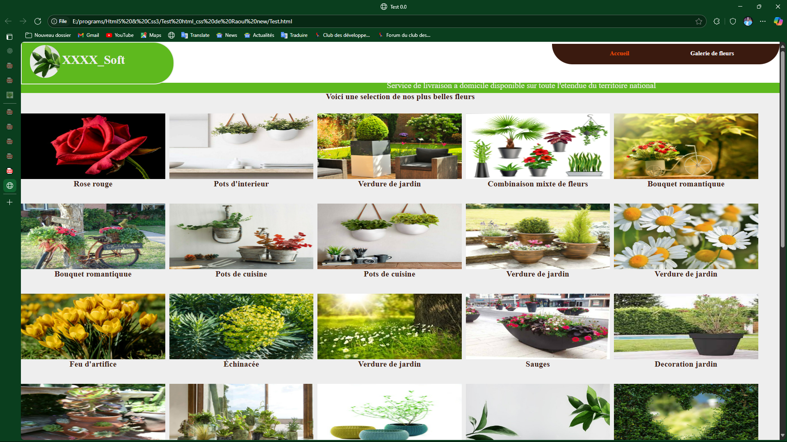

# 🌼 XXXX_Soft — Galerie de Fleurs en HTML & CSS

Ce projet est une vitrine web statique présentant une sélection de fleurs et décorations florales, entièrement développée en **HTML5** et **CSS3**.

## 🌿 Description

Le site met en valeur une galerie visuelle de fleurs, pots décoratifs et compositions florales avec une interface claire, esthétique et responsive.

- ✅ Interface en pur HTML5/CSS3
- 📷 Galerie d’images organisée par catégorie
- 🚚 Bandeau de livraison nationale
- 🟢 Design vert nature et fluide

## 📁 Arborescence du projet

/Test html_css de Raoul new
│
├── Test.html # Page principale
├── Test.css # Fichier de style CSS
├── galerie.html # Autre page de galerie
├── galerie_1.html # Variante galerie
├── /images/ # Contient les images utilisées
├── /galerie/ # (Optionnel : d’autres contenus)

## ▶️ Aperçu

## 🧑‍💻 Comment utiliser

1. Téléchargez ou clonez ce dépôt.
2. Ouvrez `Test.html` dans un navigateur pour lancer le site.
3. Assurez-vous que le dossier `/images` est bien présent avec les images.

## 💡 Améliorations possibles

- Ajout d’un carrousel ou slider en JavaScript
- Version mobile avec media queries
- Intégration d’un panier ou d’un module de commande (JS/PHP)

## 👨‍🎨 Auteur

Développé par **Mr-houngbo** — Pastly passionné de design web.

## 📄 Licence

Projet libre — à but éducatif.
